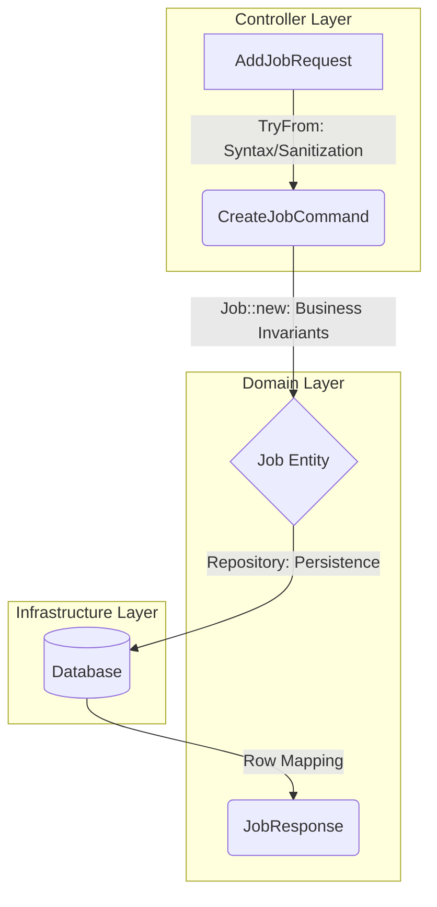

# Architecture Documentation

## Job Domain

## 1. Architectural Philosophy

This project utilizes a **Hexagonal/DDD** approach. The core principle is that **Invalid States are Unrepresentable**. We achieve this by using the Rust type system to enforce that only a validated `Job` entity can reach the persistence layer.

## 2. The Data Lifecycle (Pipeline)

| Phase            | Object             | Location              | Responsibility                                     |
| :--------------- | :----------------- | :-------------------- | :------------------------------------------------- |
| **Ingress**      | `AddJobRequest`    | Infrastructure (gRPC) | Protobuf/Prost generated transport type.           |
| **Parsing**      | `CreateJobCommand` | Controller/Service    | Syntactic validation and string sanitization.      |
| **Domain Entry** | `Job`              | Domain                | Enforces **Business Invariants** via `Job::new()`. |
| **Persistence**  | `JobRow`           | Infrastructure (Repo) | Database-specific representation.                  |
| **Read Model**   | `JobResponse`      | Domain                | Represents current state of a persisted job.       |

---

## 3. Layer Separation & Type Mapping

### A. The Write Path (Command)

The path from a gRPC request to the database ensures that no "raw" data ever hits the repository.

1. **Controller Layer**: Implements `TryFrom<AddJobRequest> for CreateJobCommand`. It performs sanitization (e.g., spaces to underscores) and structural checks.
2. **Service Layer**: Receives `CreateJobCommand`. It calls `Job::new(primitives)`.
3. **Domain Layer**: `Job::new()` returns a `Job` object only if business invariants are met.
4. **Repository Layer**: The `add_job` method specifically requires a `Job` type, ensuring the compiler prevents the insertion of unvalidated data.

### B. The Read Path (Query)

We use a **CQRS-lite** approach where the read model differs from the write model.

1. **Repository**: Fetches a `JobRow`.
2. **Domain Mapping**: The Repository instantiates a `JobResponse` (Domain type) using `JobResponse::new()`.
3. **Identity Handoff**: The Repo returns `(JobId, JobResponse)` to the service layer.
4. **Response**: The Controller maps the `JobResponse` and `JobId` to the final gRPC output.

---

## 4. Identity Management

To maintain a pure Domain layer, we distinguish between different ID types:

- **`JobId` (Domain)**: A Value Object used for business referencing.
- **`DbJobId` (Repository)**: A database-specific identifier (e.g., UUID or Serial).
- **Identity-less `Job`**: The `Job` struct (Write Model) contains no ID because it represents a concept that has not yet been assigned an identity by the system of record.

---

## 5. Logic Distribution Matrix

### Deletion and Stateless Logic

Operations that do not require state-machine validation (like `delete_job`) are handled directly via `JobId`.

- **Service Layer**: Orchestrates deletion logic (e.g., checking permissions or existence).
- **Repository**: Performs the atomic operation `delete_job(DbJobId)`.
- **Domain**: Remains uninvolved as no state transition of an entity is occurring.

### State Transitions

Transitions like `set_to_complete` are executed via the Repository using the `JobId`. This avoids coupling the Domain to Infrastructure (IO) while the Service Layer ensures the prerequisites for the transition are met before calling the repository.

---

## 6. Key Red Flag Mitigations

- **Orphan Rules**: Avoided by implementing `TryFrom` in the crate that owns the Command.
- **Coupling**: Domain has zero dependencies on Repositories or gRPC types.
- **Anemic Models**: Prevented by requiring the `Job` type for Repository insertions, forcing logic execution.
